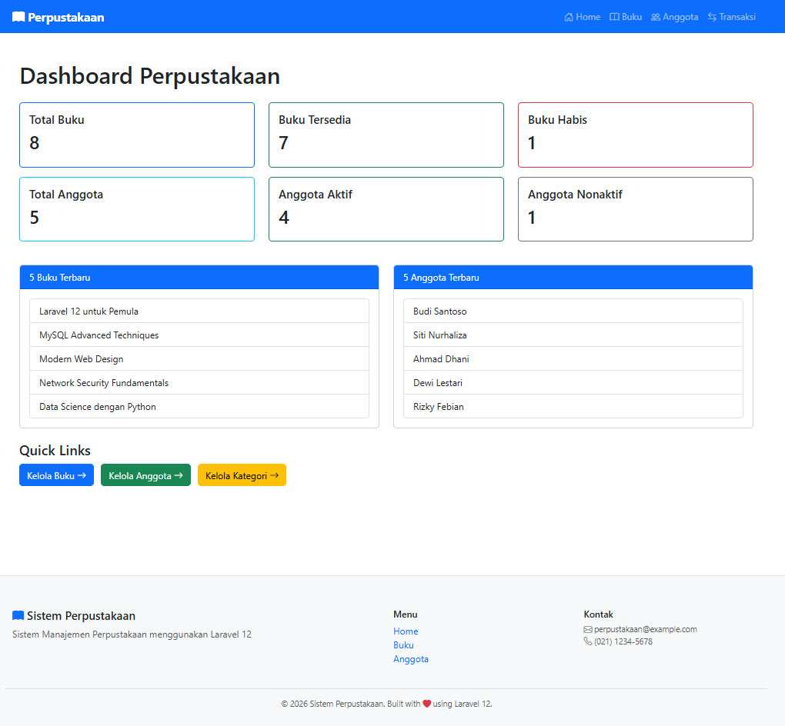
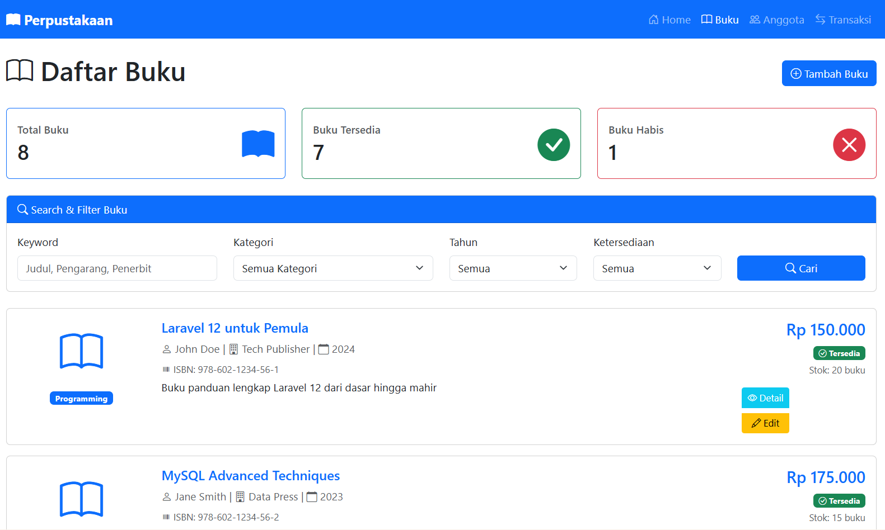
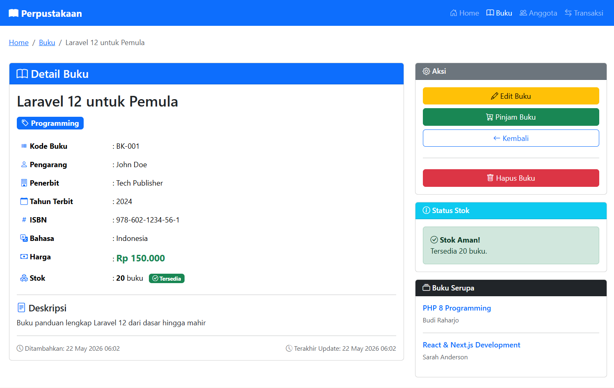
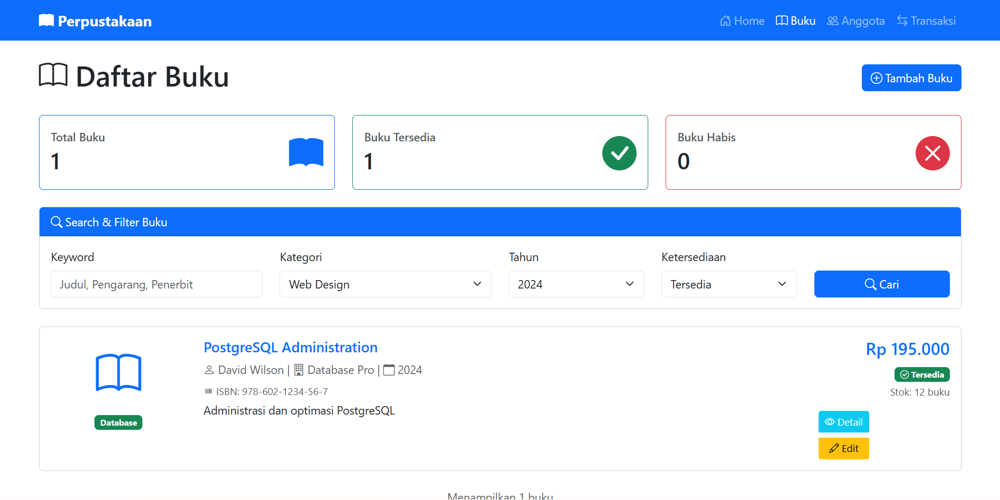

# Controller-and-View-MVC-Pattern
MVC (Model-View-Controller) adalah design pattern untuk memisahkan aplikasi menjadi 3 komponen utama. Model (Database), Controller (Logic Business), View (HTML, CSS).

# Tugas Pertemuan 13

## Identitas
**Nama:** Bima Adi Nugroho
**NIM:** 60324077

---

### Tugas 1: Membuat Halaman Dashboard
Buat halaman dashboard yang menampilkan ringkasan statistik perpustakaan.

---

### Tugas 2: Blade Component untuk Card Buku
Buat Blade Component reusable untuk menampilkan card buku.

---

### Show Act Detail

---

### Search & Filter

